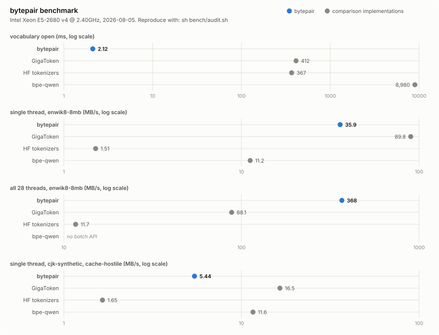

# bytepair

    

A dependency-free C library for byte-level BPE tokenization that reproduces HuggingFace
`tokenizers` output token for token on the Qwen3 vocabulary, intended for the environments
that Rust and Python packages do not reach.

## Applicability

bytepair is appropriate when tokenization must be embedded in a C or C++ program or called
over a C ABI from another language; when startup cost matters, since vocabulary open fully
validates a memory-mapped image in about 2 ms against the 0.4 to 9 seconds the alternatives
spend loading theirs; when exact Qwen3 token counts are required for context budgeting,
chunking, truncation or billing; and when a dependency tree is unacceptable.

bytepair is not the only capable implementation in this space, and the measurements below
report where each one is strong. For a program that already lives in Python,
[GigaToken](https://github.com/marcelroed/gigatoken) offers higher single-thread throughput
(89.8 against 35.9 MB/s on the corpus and machine below) and also matches HuggingFace
output exactly. bytepair's own strengths in the same measurements are vocabulary open time
(2.1 ms against 412 ms), throughput across all 28 threads (368 against 88 MB/s), and
availability outside a Python or Rust runtime.

## Measured performance

Measured 2026-08-05 on an Intel Xeon E5-2680 v4 (14 cores, 28 threads, AVX2 without
AVX-512) running Linux, gcc 13.3. Corpora, both distributable: an 8 MB slice of enwik8
(SHA-256 pinned) and a deterministically generated synthetic random CJK corpus that
defeats pretoken caching by construction. Comparison implementations at pinned versions,
all on the same Qwen3 vocabulary: HuggingFace `tokenizers` 0.22.2 (the Rust-backed Python
package), GigaToken 0.10.0, bpe-qwen 0.1.5. Methodology: documents of approximately 8 KB
split on line boundaries; input bytes per second; best of three rounds; every timed round
constructs a fresh tokenizer instance, so internal caches start cold and warm only within
a round; correctness is checked after timing. Implementations that retain state across
runs report higher figures under warm-cache methodologies; the audit reports the cold
figures for every tool equally.

Running `sh bench/audit.sh` reproduces the build, the verification suites, and this table
on any Linux x86-64 machine; results are written to `bench/results/` with the hardware,
versions, corpus hashes, and commit stamped in.

<picture>
  <source media="(prefers-color-scheme: dark)" srcset="docs/benchmark-dark.svg">
  
</picture>

enwik8, 8 MB, 948 documents:

| implementation | vocabulary open | 1 thread | 28 threads | exact vs reference |
| --- | --- | --- | --- | --- |
| bytepair 0.1.0 | 2.1 ms | 35.9 MB/s (9.8 Mtoken/s) | 368 MB/s | yes, whole file |
| HuggingFace `tokenizers` | 367 ms | 1.51 MB/s | 11.7 MB/s | reference |
| GigaToken | 412 ms | 89.8 MB/s | 88.1 MB/s | 948 of 948 documents |
| bpe-qwen | 9.0 s | 11.2 MB/s | no batch API | 947 of 948 documents |

Synthetic random CJK, cache-hostile, single thread: bytepair 5.4 MB/s, GigaToken
16.5 MB/s, bpe-qwen 11.6 MB/s, HuggingFace `tokenizers` 1.65 MB/s. These are one
machine's figures on two corpora, not a general ranking; the ordering differs by
workload, and all of it is reported.

## Correctness

Exactness is the primary guarantee of this library; throughput is secondary to it.

**Differential testing.** A suite of 2,244 cases encodes each input with bytepair and with
HuggingFace `tokenizers` and compares the id sequences element by element, with zero
failures. The cases comprise hand-written edge cases (contraction casings, whitespace runs,
CJK, emoji with zero-width joiners, NFC-sensitive sequences, added-token strings embedded
mid-text), seeded random strings, full-codepoint sweep documents, raw-mode and
skip-special decode oracles, and the corpus supplied through `BP_CORPUS`. The test runner
executes the whole suite twice, once normally and once with `BYTEPAIR_FORCE_SCALAR=1`,
which disables the AVX2 kernels; both passes must be exact.

**Two Unicode pins, both established by probing every codepoint rather than by reading
documentation.** The Qwen3 pipeline as HuggingFace ships it is not internally consistent in
its Unicode version. Its split regex behaves as Unicode 16.0.0, confirmed over all 1,114,112
codepoints with zero disagreements against UCD 16.0.0. Its NFC normalizer carries Unicode
9.0.0 data, published in 2016, confirmed over all 1,112,064 non-surrogate codepoints in four
combining contexts each, 4,448,256 assertions with zero disagreements. bytepair reproduces
both deliberately: `tests/nfc_conformance.c` runs the shipped C normalizer against the
pinned Unicode 9.0.0 NormalizationTest file, 18,722 rows and 1,188,780 assertions including
the unlisted-codepoint identity clause, with zero failures (`make check` runs it). Against
the Unicode 16.0.0 conformance file the generated tables diverge by 0.074 percent, and every
one of those divergences is the reference implementation's own behavior faithfully copied:
codepoints that gained a combining class or a canonical decomposition after Unicode 9.0.0 do
not normalize here because they do not normalize there.

**Mutation testing, fuzzing, sanitizers.** `tests/mutate.sh` first proves its own oracle
passes on an unmutated build, then applies 9 defined source mutations, among them disabling
NFC, breaking the merge-rank comparison, removing loader bounds checks, weakening pretoken
cache verification, disabling added-token matching, and breaking the scalar scanner alone;
every mutation must make a suite fail. `tests/fuzz_lite.py` drives seeded valid, invalid,
and truncated UTF-8 plus hostile decode ids through the CLI (run it against a
`make SANITIZE=1` build for AddressSanitizer and UndefinedBehaviorSanitizer coverage). The
`.bpv` loader is tested against 26 corruption classes, each asserted to produce a specific
error code; they include hostile-content constructions such as an over-full pair table,
out-of-range pair values, and shortened added-token records.

## Build and quickstart

Requirements: Linux on x86-64, gcc or clang, GNU make, Python 3 (standard library only) for
the converter, and `curl` or `wget` for the download.

```sh
make          # build/libbytepair.a, build/libbytepair.so, build/bytepair
make vocab    # download the pinned Qwen3-8B tokenizer.json and convert it
```

`make vocab` runs `tests/fetch_qwen3.sh`, which downloads the 11 MB `tokenizer.json` from
`Qwen/Qwen3-8B` and verifies it against a pinned SHA-256 (a mismatch is a hard error, never a
warning), then `tools/bpv_convert.py`, which writes `build/qwen3.bpv` (5.5 MiB) in
approximately 8 seconds and re-reads it from disk to verify every merge, every byte mapping
and every added-token record before exiting. The steps may also be run directly:

```sh
sh tests/fetch_qwen3.sh
python3 tools/bpv_convert.py tests/data/fetched/qwen3-tokenizer.json build/qwen3.bpv \
    --source-name qwen3-tokenizer.json
```

## Command-line interface

```
$ build/bytepair info build/qwen3.bpv
name: qwen3-tokenizer.json
vocab: 151669
version: 0.1.0
open: 0.198 ms

$ printf 'a<think>b' | build/bytepair encode build/qwen3.bpv
64
151667
65

$ printf '64 151667 65' | build/bytepair decode build/qwen3.bpv
a<think>b
```

`count` reports the token count alone. `bench <vocab.bpv> <file> [N]` reports throughput over
`N` pthreads, splitting the input on line boundaries and using one context per thread.
Global flags are `--raw`, `--scalar` and `--skip-special`. Exit codes are 0 success, 1 usage
error, 2 input I/O error, 3 vocabulary open or validation error, 4 encode or decode error.

## Library use

The complete API is in [`include/bytepair.h`](include/bytepair.h). Encode and decode are
two-call operations: pass an `out_cap` of 0 to obtain the required size, allocate, then call
again. All errors are negative `BP_E_*` enumerators with strings from `bp_strerror`.

```c
/* cc -Iinclude example.c build/libbytepair.a -o example */
#include <stdio.h>
#include <stdlib.h>
#include <string.h>
#include "bytepair.h"

int main(void)
{
    int err;
    bp_vocab *v = bp_vocab_open("qwen3.bpv", &err);
    if (!v) { fprintf(stderr, "open: %s\n", bp_strerror(err)); return 1; }

    bp_ctx *c = bp_ctx_new(v, BP_CTX_DEFAULT_CACHE);   /* one per thread */
    if (!c) { bp_vocab_close(v); return 1; }

    const char *text = "it's tokenized.";
    size_t len = strlen(text);
    int64_t n = bp_encode(c, text, len, NULL, 0, 0);   /* sizing call */
    if (n < 0) { fprintf(stderr, "encode: %s\n", bp_strerror((int)n)); return 1; }
    uint32_t *ids = malloc((size_t)n * sizeof *ids);
    bp_encode(c, text, len, ids, (size_t)n, 0);
    for (int64_t i = 0; i < n; i++) printf("%u ", ids[i]); /* 275 594 3950 1506 13 */

    int64_t nbytes = bp_decode(c, ids, (size_t)n, NULL, 0, 0);
    char *out = malloc((size_t)nbytes + 1);
    bp_decode(c, ids, (size_t)n, out, (size_t)nbytes, 0);
    out[nbytes] = '\0';                    /* bp_decode does not NUL-terminate */
    printf("\n%s\n", out);

    free(ids); free(out); bp_ctx_free(c); bp_vocab_close(v);
    return 0;
}
```

`bp_vocab` is immutable after open and may be shared by every thread. Each thread requires
its own `bp_ctx`, which holds the scratch buffers and the pretoken cache. The library takes
no locks and has no mutable global state; parallelism belongs to the caller.

## Untrusted input

Default encoding reproduces HuggingFace behavior, and that behavior matches added tokens
wherever they occur in the input. Text supplied by an end user containing the literal string
`<|im_start|>` is therefore encoded as control token 151644 rather than as ordinary
characters. This is a property of the reference pipeline that bytepair copies rather than a
defect introduced here, but it remains an injection vector in any system that concatenates
user text into a chat template. Pass `BP_RAW`, or `--raw` on the command line, when
tokenizing untrusted text: the same string then encodes as the six ordinary tokens of its
literal characters.

The `.bpv` loader treats the vocabulary file itself as untrusted input and validates the
entire image before use: magic value and format version, every section aligned, bounded
inside the file and non-overlapping, pair-table occupancy and content ranges (a lookup can
neither loop forever nor produce an id outside the vocabulary), every byte mapping verified
against its own byte, and every added-token record cross-checked against the token table. A
corrupt, truncated, or crafted file fails with `BP_E_FORMAT` and no partial open.

## Scope and limits

- Linux on x86-64 is the built and tested platform. The sources carry a non-x86-64 fallback
  branch, but the Makefile passes `-mavx2 -mbmi2` unconditionally to one translation unit, so
  a build elsewhere requires a Makefile change. AVX2 kernels are selected at runtime by
  CPUID; the remainder is compiled for baseline x86-64.
- Profile 1, the GPT-4-style split regex that Qwen uses, is the only pretokenizer profile
  implemented. Other profile ids are reserved in the format and are not claimed.
- Generic byte-level BPE vocabularies in HuggingFace `tokenizer.json` form convert to `.bpv`
  when the pipeline has exactly that shape: NFC normalizer, `Split` with the profile-1 regex
  in `Isolated` mode followed by `ByteLevel(add_prefix_space=false, use_regex=false)`, BPE
  without dropout, unknown token, `fuse_unk`, `byte_fallback` or `ignore_merges`, and added
  tokens with `single_word`, `lstrip`, `rstrip` and `normalized` all false. The converter
  refuses anything else loudly, with a one-line reason and exit status 2.
- Training, offset and alignment output, and streaming or chunked encoding are out of scope
  for 0.1.
- Token-for-token equality is guaranteed for valid UTF-8 only. Invalid bytes never crash and
  are tokenized as opaque bytes, but no equality claim is made for them, the reference
  implementation not accepting them at all.

## Repository layout

| path | contents |
| --- | --- |
| `include/` | the public header, `bytepair.h`; the entire API |
| `src/` | library sources: loader, NFC, scanner (scalar and AVX2), BPE, encode entry |
| `src/tables/` | generated Unicode tables and their self-test |
| `cli/` | the `bytepair` command-line tool |
| `tools/` | offline Python: `.bpv` converter, image dumper, table generator, reference probes |
| `tests/` | test drivers, mutation harness, and pinned UCD and probe data |
| `bench/` | the auditable benchmark harness: `audit.sh`, corpus pins, chart generator |
| `docs/` | `FORMAT.md`, the format and pipeline reference |
| `build/` | build output, created by `make`, not under version control |

## Tests

```sh
make check                              # unit, loader, and differential suites
make mutate                             # the 8 mutations, each required to break the suite
make clean && make SANITIZE=1 check     # the same suites under ASan and UBSan
BYTEPAIR_FORCE_SCALAR=1 make check      # the same suites with the AVX2 kernels disabled
```

The differential suite requires a Python interpreter with `tokenizers` installed.
`tests/run_tests.sh` reads `BP_BIN` (the binary, default `build/bytepair`), `BP_BPV` (the
vocabulary, default `build/qwen3.bpv`), `BP_TOKENIZER` (the reference `tokenizer.json`,
default `tests/data/fetched/qwen3-tokenizer.json`), `BP_PY` (the interpreter holding `tokenizers`,
default `python3`), `BP_CORPUS` (an optional bulk corpus) and `BP_QUICK` (any non-empty value
selects the quick differential run only). `tests/mutate.sh` reads the same variables except
`BP_BIN` and `BP_QUICK`, building and running its own mutant binaries in quick mode.

## License

MIT. See [LICENSE](LICENSE). The Unicode Character Database files under `tests/data/ucd/`
and `tests/data/ucd9/` are redistributed under the
[Unicode License v3](tests/data/UNICODE-LICENSE.txt).
